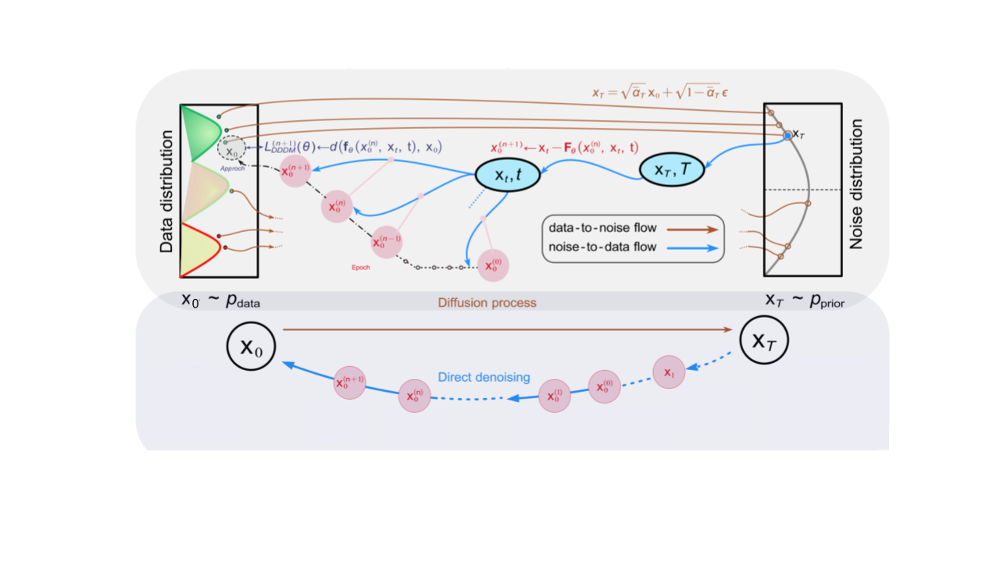

# breaking-bottlenecks-3d-diffusion

   
  <em>
    Overview of the diffusion generative process and reverse denoising dynamics.
    The top panel shows the forward noising trajectory from the data distribution
    pdata to the noise prior pprior, along with the corresponding
    reverse kernel approximation used during training.
    The bottom panel illustrates sampling via direct denoising from xT back
    to the clean data x0.
  </em>

